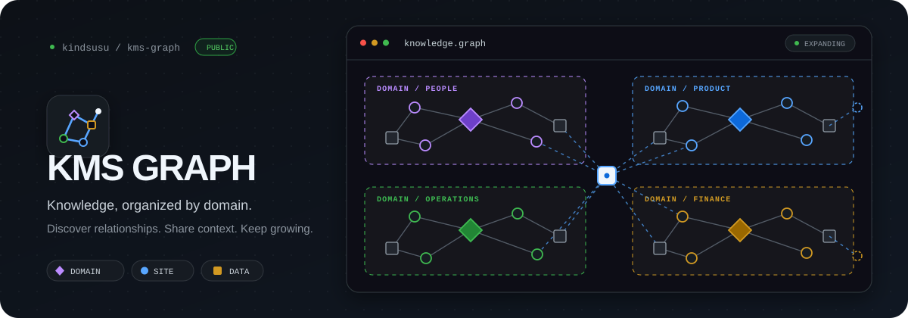

<p align="center"></p>

# KMS Graph

English · [한국어](README.ko.md)

A Claude Code skill that turns the web apps your employees build into a single static page with a **graph view and a list view**.
Employees register their apps in a Google Sheet or a Notion database. Once an admin approves an entry, the page is rebuilt daily, pushed to GitHub Pages, and a summary is posted to a Teams channel.

## How it works

```
Employees → register an app in the sheet or Notion (name · URL · description · domain · data sources · prompt)
Admin     → tick "approved"
build.py
   1. read approved rows
   2. validate against the master lists (domains · data sources) and check formats
   3. probe each URL
   4. diff against yesterday's snapshot: added · changed · removed
   5. render index.html (data embedded; the only external dependency is vis-network)
   6. git push → GitHub Pages
Claude    → reads the report and posts an admin summary to Teams
```

The graph has three kinds of nodes.

| Node | Shape | Meaning |
|---|---|---|
| Domain | diamond | A business area. Groups the sites |
| Site | circle | A web app built by an employee |
| Data source | square | A sheet, document, or system the app reads |

The list tab opens first. In the graph tab, clicking a node shows its URL, description, author, tool, prompt, and data sources in a side panel. Search and domain filters are shared by both tabs.

When a submitted domain or data-source value is not in the master list, the row is held as "pending classification". Claude decides whether it matches an existing entry or needs a new one and records the decision, with a one-line reason, in `mappings.json`. A decision is never asked again, and every classification made that day is listed in the Teams message. Admins can override by editing `mappings.json` or the original value.

## Install

Requirements: Python 3.10+, `requests`. Add `google-auth` if you read from Google Sheets.

```bash
git clone https://github.com/kindsusu/kms-graph "$HOME/.claude/skills/kms-graph"
pip install requests google-auth
```

Type `/kms-graph` in Claude Code. On the first run it asks which source you use (Google Sheets or Notion) and the values it needs, then writes `config.json`. To set it up by hand, copy `config.example.json`.

## Prepare the source

### Google Sheets

One spreadsheet with three tabs. Tab names and the header row must match exactly. You can paste the CSV files in `sample/` to start.

- `사이트` tab: 사이트명 · URL · 소개 · 도메인 · 참조데이터 · 작성자 · 도구 · 프롬프트 · 등록일 · 승인 · 비고
- `도메인` tab: 도메인명 · 설명 · 색상
- `참조데이터` tab: 데이터명 · 종류 · 담당팀 · 설명

Make `승인` (approved) a checkbox and give `도메인` a data-validation dropdown pointing at the `도메인` tab. Separate multiple `참조데이터` values with commas. Link a Google Form to the `사이트` tab so employees can submit through the form.

Read access goes through a service account. Enable the Sheets API in Google Cloud, create a service-account key (JSON), and share the spreadsheet with the service-account email as a viewer. Put the key path in `service_account_json`.

### Notion database

Set `source` to `notion` in `config.json` and prepare one database for sites. Property names are the same as the sheet headers.

| Property | Type |
|---|---|
| 사이트명 | Title |
| URL | URL |
| 도메인 | Select (its options become the domain master list) |
| 참조데이터 | Multi-select (its options become the data-source master list) |
| 승인 | Checkbox |
| 소개 · 작성자 · 도구 · 프롬프트 · 비고 | Text |
| 등록일 | Date |

Create a read-only integration at notion.so/my-integrations, put its token in `notion_token`, and connect the integration to the database from the database's connection menu. The database ID is the 32-character value in the URL; put it in `notion_db_sites`. To manage the type, owning team, and description of each data source, create a second database and set `notion_db_data`.

## Publish and notify

- **GitHub Pages**: create a repository for the page, clone it, commit a `docs/` folder, and set Settings > Pages to the `main` branch, `/docs` folder. Put the clone path in `repo_dir`.
- **Access control**: a GitHub Pages site is public even when the repository is private. Point a company domain at it through Cloudflare and add a Zero Trust Access policy that allows only your company email domain, so only signed-in staff can open the page.
- **Teams**: in Power Automate, build a flow with the trigger "When a Teams webhook request is received" and the action "Post card in a chat or channel". Put the generated URL in `teams_webhook`.

## config.json

```json
{
  "source": "sheets",
  "sheet_id": "",
  "service_account_json": "C:/keys/kms-sheets.json",
  "notion_token": "",
  "notion_db_sites": "",
  "notion_db_data": "",
  "mappings_file": "mappings.json",
  "check_urls": true,
  "repo_dir": "C:/work/kms-pages",
  "out_subdir": "docs",
  "page_url": "https://kms.example.com",
  "teams_webhook": "",
  "site_title": "KMS"
}
```

Keep `config.json` out of git. Keep `mappings.json` in git. Set `check_urls` to `false` when building outside the network that hosts intranet-only apps.

## Run

```bash
# dry run (touches neither the sheet nor the repository)
python build.py --csv-dir sample --out out --no-check-urls

# real build and push
python build.py --config config.json --push

# send the notification
python build.py --config config.json --notify out/message.md

# self-check
python test_build.py
```

For the daily run, pick one. A Claude Code scheduled task on the admin's PC can probe intranet URLs and keeps the key file local, but the PC must be on at that time. A claude.ai cloud routine runs regardless of the PC, but needs the key and webhook stored as environment secrets and cannot reach the intranet.

## Files

| File | Role |
|---|---|
| `SKILL.md` | The daily procedure Claude follows |
| `build.py` | Read · validate · probe · diff · render · push · notify |
| `template.html` | Page template |
| `config.example.json` | Config example |
| `sample/` | Sample CSVs and a mappings example |
| `test_build.py` | Self-check |

## License

PolyForm Noncommercial 1.0.0. Free for personal, non-profit, educational, and research use; commercial use is restricted.
